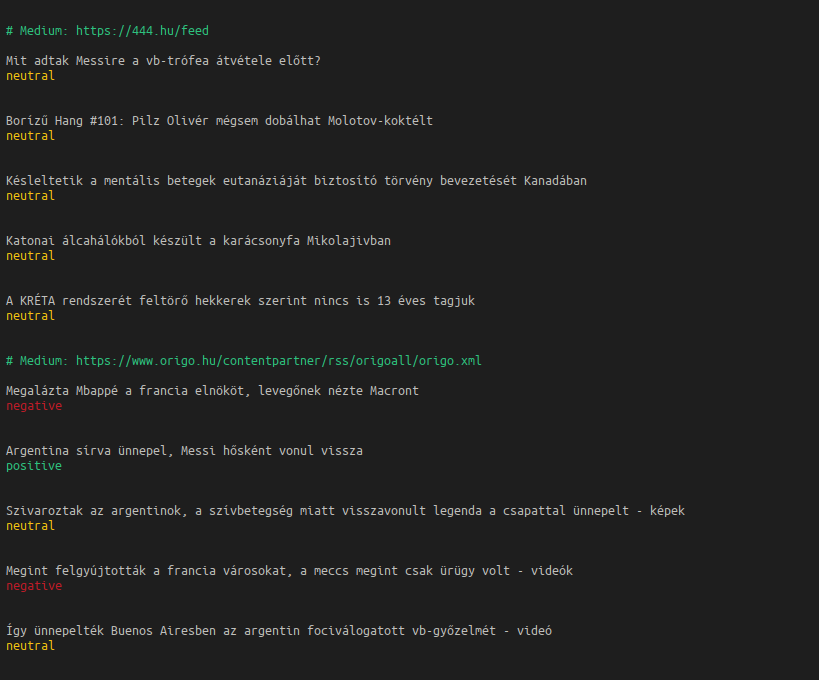
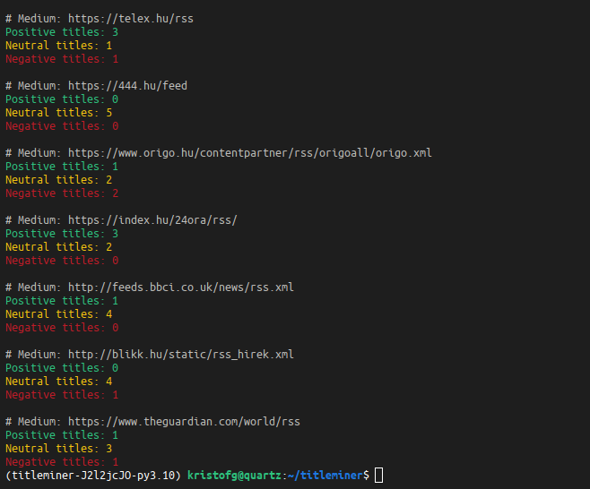
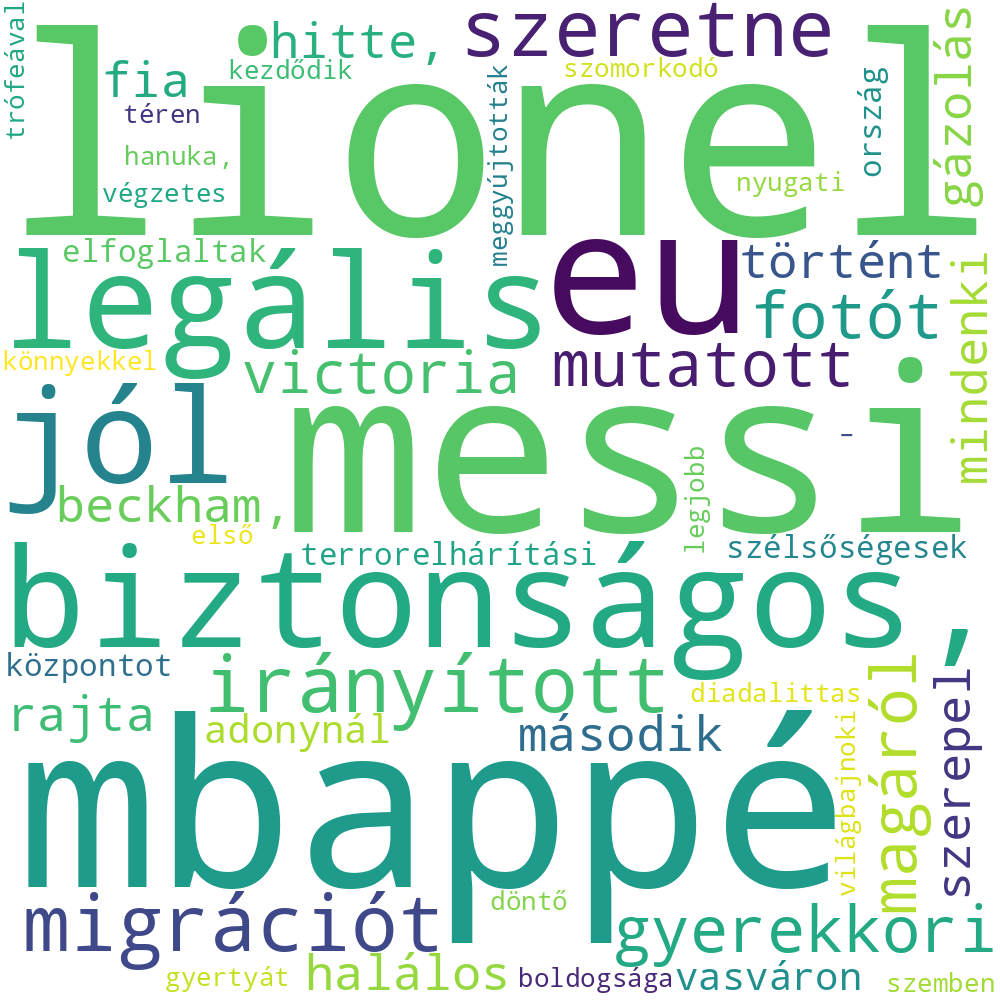

# Mi az a titleminer?

A titleminer egy eszköz a címek kinyerésére híroldalakról.
Ez egy parancssori eszköz, amely az URL-ek listáját veszi be bemenetként, és ez alapján generál wordcloud-ot a címekből, vagy OpenAI moduljának segítségével osztályozza a címeket.

Python nyelven íródott, és a [Beautiful Soup](http://www.crummy.com/software/BeautifulSoup/) könyvtárat használja a HTML elemzéséhez.

# Telepítés

A titleminerhez Python 3.10 és poetry szükséges.

A titleminer telepítéséhez futtassa a következő parancsokat:

     poetry install

# Használat

A titleminer felveszi az URL-ek listáját egy szöveges fájlban, és kiírja a konzolba a weboldalak címében található leggyakoribb szavakat.
    
    poetry run titleminer feeds.txt

Lehetőség van a címeket osztályozni OpenAI moduljának segítségével.
    
    poetry run titleminer sentiment feeds.txt --limit 10 --openai-key <openai_key>

Lehetőség van wordcloud létrehozására.

    poetry run titleminer wordcloud feeds.txt

További lehetőségekért tekintse meg a súgót:

     poetry run titleminer --help

# Példa

Sentiment analízis:

eredmények láthatóak a `sentiment.csv` fájlban.
[sentiment.csv](sentiment.csv)

Foci vb zárómecsse után jól látható, hogy ezek a címekben a leggyakrabban előforduló szavak:

# Fejlesztés

openai ingyenes szolgáltatási szintjén korlátozott mennyiségű API hívást lehet végrehajtani, ezért a `titleminer`-ben a `--limit` paraméterrel lehet korlátozni a hívások számát. Illetve szintén ezért nem párhuzamosított a kód.